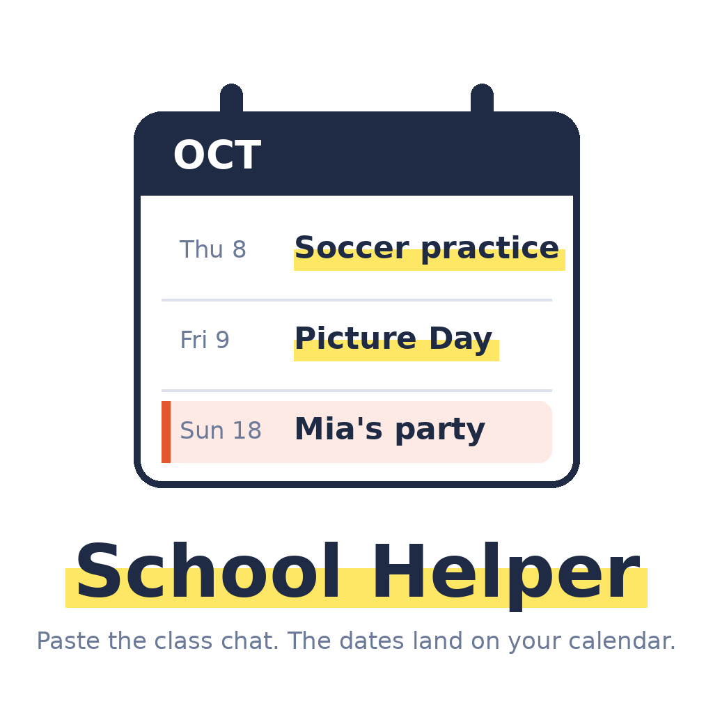
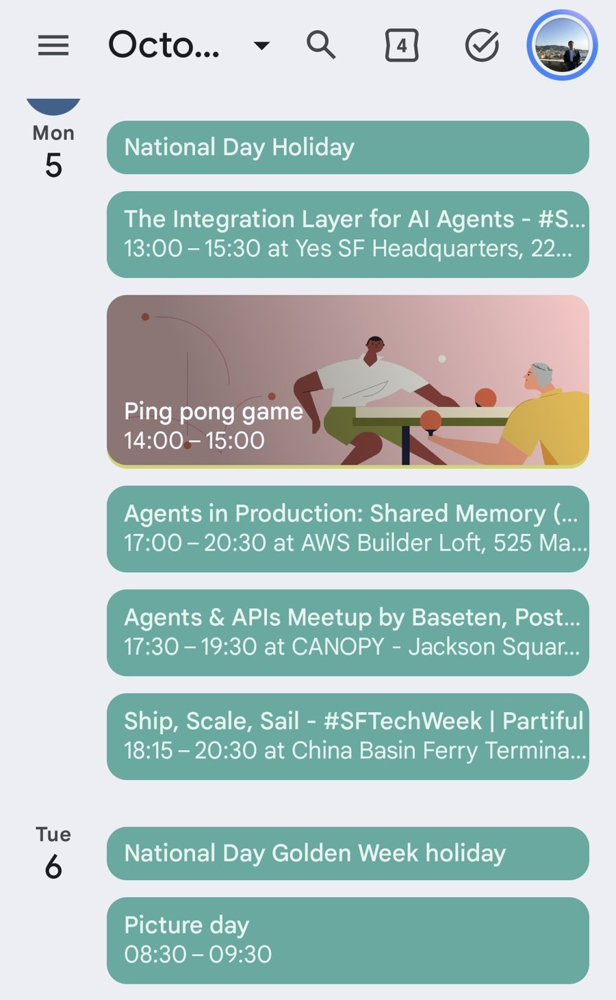
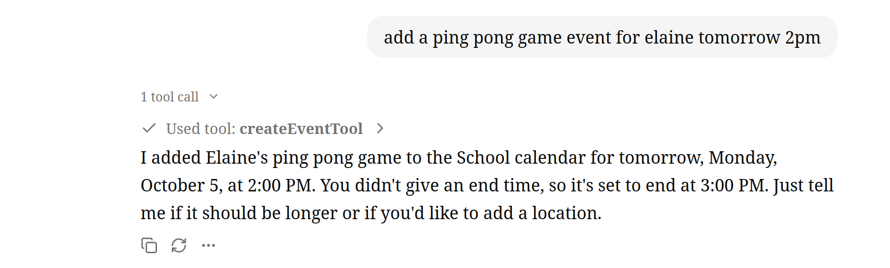
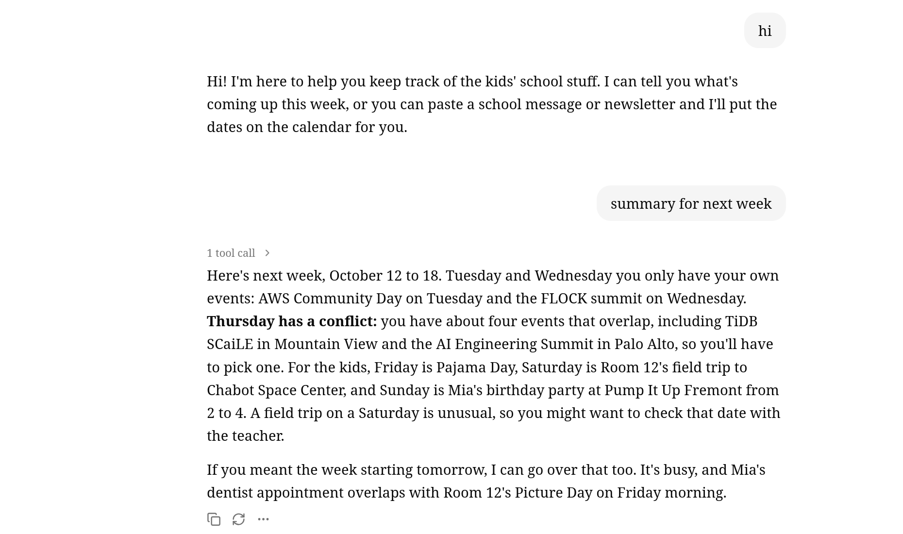

# School Helper



Personal agent for busy parents. Paste the class group chat, forward a WhatsApp message, or drop a
screenshot. It pulls out the dates, checks them against your Google Calendar, adds them to a
separate "School" calendar, and replies in plain English. Give it the school's name and it also
pulls the public newsletter calendar, rechecked daily.

- Dashboard: https://school-helper-b3yxo.sprites.app/app
- Chat: https://school-helper-web-b3yxo.sprites.app
- Email the agent: school-helper@agentmail.to

Built at the Build Personal Agents Hack (Oct 2026) with Mastra, Claude, Neon AI Gateway, Exa,
AgentMail, WhatsApp Cloud API, Google Calendar, assistant-ui, and Fly.io Sprites.

The event from the chat, on the phone next to the family's own calendar:



## Run

```
cd agent
cp .env.example .env        # fill in keys
npx tsx scripts/auth-google.ts   # once, needs credentials.json from Google Cloud
pnpm dev                    # http://localhost:4111/app
```

The chat agent calls Claude through the Neon AI Gateway when `neon link` has pulled the gateway
variables (`agent/neon.ts` enables it); the extractor uses the direct Anthropic key because the
gateway does not pass structured-output requests.

Tests: `pnpm test`. Extraction check without touching the calendar:
`npx tsx scripts/extract.ts fixtures/whatsapp-export.txt`.

## Deploy (Fly.io Sprite)

The agent runs as a service on a sprite; `agent/start.sh` loads `.env` and starts the built server.
Upload with `tar czf - --exclude=node_modules --exclude=.mastra . | sprite exec -s school-helper -- bash -c 'cat > ~/app/src.tgz'`,
then `pnpm install && pnpm build` inside and `sprite-env services create web --cmd /bin/bash --args ~/app/start.sh --http-port 4111`.

## Access

The deployment requires a family code. The dashboard asks for it once and remembers it in the
browser; the chat takes it from `?code=` in the URL once. Set it with `APP_TOKEN` in `agent/.env`.
`ALLOWED_SENDERS` lists the parents' email addresses so only they can add events by email. Leaving
both unset makes the agent open, which is only right for a demo. Per-parent Google sign-in is the
proper long-term answer and is not built.

## Channels

- Dashboard at `/app`: paste a thread or drop a screenshot.
- Email (AgentMail): `npx tsx scripts/setup-agentmail.ts https://<host>` creates the inbox and webhook.
  Parents share a WhatsApp "Export chat" or forward a school email to that address and get a reply.
- WhatsApp (Meta Cloud API): webhook `https://<host>/whatsapp`, verify token from `.env`, subscribe
  to `messages`. Parents forward messages to the agent's number; it replies in the same thread.
  Built and verified against Meta's handshake, but needs a Meta developer app to go live.

## Chat UI





`web/` is a Next.js app with assistant-ui talking to the agent's `/chat/schoolAgent` route, with
event cards for tool results. Locally: `cd web && cp .env.example .env.local && pnpm dev`, then open
http://localhost:3000. Deployed the same way as the agent, on its own sprite with `web/start.sh` and
`NEXT_PUBLIC_AGENT_URL` set to the agent's public URL in `.env.production` before `pnpm build`.
